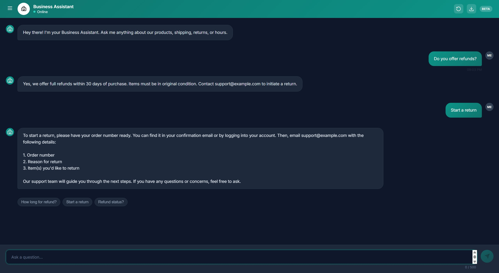
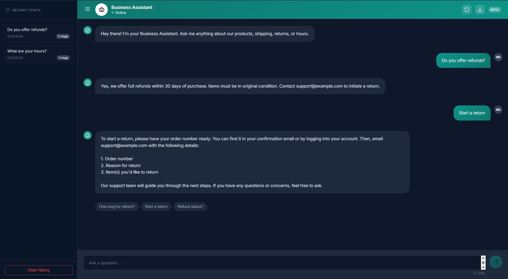
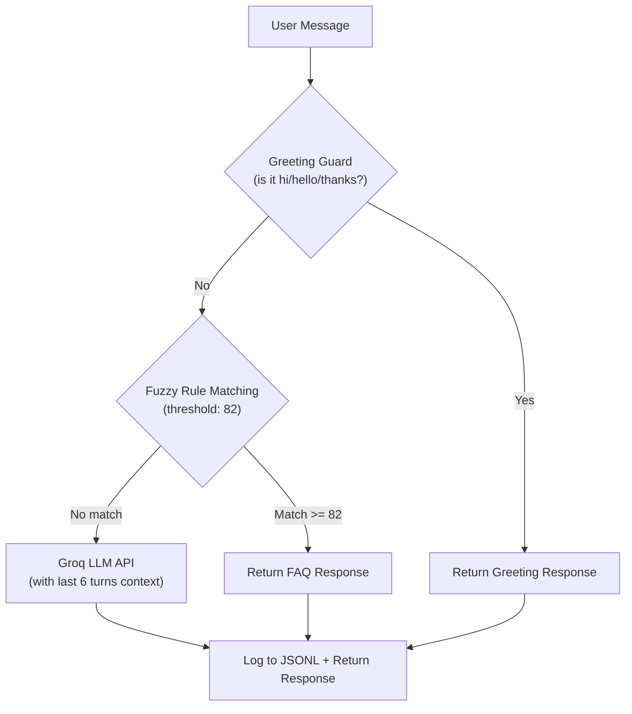

# Business Assistant — AI-Powered Hybrid Chatbot


*A smart FAQ + LLM hybrid chatbot for small businesses, built with FastAPI and Groq AI.*

---

## ✨ Overview

Business Assistant provides an intelligent, cost-effective customer support solution tailored for small businesses. It employs a hybrid architecture that prioritizes instant, deterministic answers to common questions using rule-based fuzzy matching. When user queries fall outside predefined FAQs, the system seamlessly escalates to Groq AI, maintaining conversation context for highly accurate, open-ended responses. This approach minimizes expensive API calls while ensuring customers receive immediate and helpful support without complex infrastructure requirements.

## 🚀 Features

### Core Chatbot
- [x] Fuzzy FAQ matching with configurable threshold (RapidFuzz)
- [x] LLM fallback via Groq API for open-ended questions
- [x] Greeting/stopword guard to prevent false matches
- [x] Session-aware multi-turn conversation history
- [x] JSONL conversation logging with timestamps and metadata

### UI Features
- [x] Dark teal-slate theme with smooth animations
- [x] New Chat with confirmation modal
- [x] Export chat as `.txt` file
- [x] Hover-to-reveal message actions (copy, thumbs up/down)
- [x] Quick reply suggestion chips
- [x] Typewriter animation for bot responses
- [x] Collapsible sidebar with chat history (`localStorage`)
- [x] Character counter with 500-char limit
- [x] Scroll-to-bottom floating button
- [x] Connection status indicator

### Developer Features
- [x] `/api/health` endpoint with rules count
- [x] `/api/test-llm` debug endpoint
- [x] `/api/feedback` endpoint for rating logs
- [x] `/api/logs` returns last 50 conversation entries
- [x] Auto-creates `logs/` directory on startup
- [x] Startup warning if `GROQ_API_KEY` is missing

## 📸 Screenshots

📸 Screenshot: Chat interface showing FAQ and AI responses


📸 Screenshot: Sidebar with chat history


📸 Screenshot: Export and new chat modal
> *(Place Export Modal Image Here)*

## ⚙️ How It Works



The hybrid architecture guarantees rapid, cost-free responses for high-volume, routine inquiries by running them through a fuzzy matching engine first. The greeting guard intercepts conversational filler to avoid unnecessary processing. If the user's intent is complex or novel, the system leverages the Groq LLM, providing it with the last six conversational turns to maintain context. Every interaction, regardless of the resolution path, is appended to a structured JSONL log, enabling continuous improvement of the core rule set based on real user interactions.

## 📡 Getting Started

### Prerequisites
- Python 3.10+
- A Groq API key ([Get one from the Groq Console](https://console.groq.com))

### Installation

```bash
# 1. Clone the repository
git clone https://github.com/yourusername/business-assistant.git
cd business-assistant

# 2. Create and activate virtual environment
python -m venv venv
source venv/bin/activate  # Windows: venv\Scripts\activate

# 3. Install dependencies
pip install -r requirements.txt

# 4. Set up environment variables
cp .env.example .env
# Edit .env and add your GROQ_API_KEY

# 5. Run the server
uvicorn main:app --reload --port 8000

# 6. Open in browser
# Visit http://localhost:8000
```

## 🗂️ Configuration

| Variable | Default | Description |
|---|---|---|
| `GROQ_API_KEY` | *required* | Your Groq API key |
| `FUZZY_MATCH_THRESHOLD` | `82` | Min score for FAQ match (0-100) |

### Customizing FAQ Rules
Edit `data/rules.json` to define your specific business knowledge. Here is a minimal example showing the required fields:

```json
{
  "rules": [
    {
      "id": "store_hours",
      "category": "logistics",
      "patterns": [
        "What time do you open?",
        "Are you open on weekends?",
        "Store hours"
      ],
      "response": "We are open Monday to Friday from 9 AM to 6 PM, and Saturdays from 10 AM to 4 PM. We are closed on Sundays."
    }
  ]
}
```

- **`id`**: Unique identifier for tracking which rules trigger most often.
- **`category`**: Groups related questions for potential analytics.
- **`patterns`**: Phrases the fuzzy matcher will compare against the user's input.
- **`response`**: The exact text returned when a pattern matches.

## 🤝 API Reference

| Method | Endpoint | Description |
|---|---|---|
| POST | `/api/chat` | Send a message, get a response |
| GET | `/api/health` | Health check + rules count |
| GET | `/api/logs` | Last 50 conversation entries |
| GET | `/api/test-llm` | Debug LLM connectivity |
| POST | `/api/feedback` | Submit thumbs up/down rating |

<details>
<summary><strong>POST /api/chat</strong></summary>

**Request:**
```json
{
  "message": "Do you offer refunds?",
  "history": [
    {"role": "user", "content": "Hi"}, 
    {"role": "assistant", "content": "Hello! How can I help?"}
  ]
}
```

**Response:**
```json
{
  "response": "Yes, we offer full refunds within 30 days of purchase.",
  "source": "rule_match"
}
```
</details>

<details>
<summary><strong>GET /api/health</strong></summary>

**Response:**
```json
{
  "status": "healthy",
  "rules_loaded": 15
}
```
</details>

<details>
<summary><strong>GET /api/logs</strong></summary>

**Response:**
```json
[
  {
    "timestamp": "2023-10-15T12:00:00Z",
    "user_message": "Do you offer refunds?",
    "bot_response": "Yes, we offer full refunds within 30 days of purchase.",
    "source": "rule_match",
    "match_score": 95
  }
]
```
</details>

<details>
<summary><strong>GET /api/test-llm</strong></summary>

**Response:**
```json
{
  "status": "success",
  "message": "LLM connection verified."
}
```
</details>

<details>
<summary><strong>POST /api/feedback</strong></summary>

**Request:**
```json
{
  "message_id": "12345",
  "rating": "thumbs_up"
}
```

**Response:**
```json
{
  "status": "success"
}
```
</details>

## 🏗️ Project Architecture

- **`main.py`**: FastAPI application entry point, mounts static files, and initializes core modules.
- **`router/chat.py`**: Defines API endpoints for chatting, health checks, logging, and feedback.
- **`core/rule_engine.py`**: Handles loading JSON rules and performing RapidFuzz string matching.
- **`core/llm_client.py`**: Manages the Groq API client, constructs prompts, and handles fallback logic.
- **`core/logger.py`**: Appends structural conversation events (JSONL format) to local files.
- **`data/rules.json`**: The static knowledge base defining exact patterns and responses.
- **`static/index.html`**: A single-file frontend containing HTML, CSS (dark teal-slate theme), and JavaScript logic.

## 🛠️ Customizing for Your Business

1. **How to add/edit FAQ rules in `rules.json`**
   Open `data/rules.json` and add new JSON blocks matching common questions you receive. The bot incorporates these changes instantly, requiring no restarts.
2. **How to change the bot name and branding in `index.html`**
   Modify `static/index.html` to update the document `<title>`, header text (e.g., from "Business Assistant" to your brand name), and adjust any CSS color variables to match your corporate identity.
3. **How to adjust the LLM system prompt in `llm_client.py`**
   Open `core/llm_client.py` and modify the system prompt string to reflect your business's tone and constraints (e.g., "You are a helpful, enthusiastic assistant for a boutique coffee shop. Keep answers under 3 sentences.").

## 🗺️ Roadmap

- [ ] Streaming LLM responses (word-by-word)
- [ ] PostgreSQL-backed conversation storage
- [ ] Admin dashboard for FAQ management
- [ ] WhatsApp / Slack integration
- [ ] Multi-language support
- [ ] Analytics dashboard (top questions, fallback rate)
- [ ] Docker + docker-compose setup
- [ ] Unit tests with `pytest`

## 🤝 Contributing

We welcome contributions to make this project even better.

1. Fork the repository
2. Create a new branch (`git checkout -b feature/amazing-feature` or `git checkout -b fix/annoying-bug`)
3. Commit your changes (`git commit -m 'Add some amazing feature'`)
4. Push to the branch (`git push origin feature/amazing-feature`)
5. Open a Pull Request

*Please open an issue first to discuss significant changes before submitting a PR.*

## 📄 License

This project is licensed under the MIT License.
